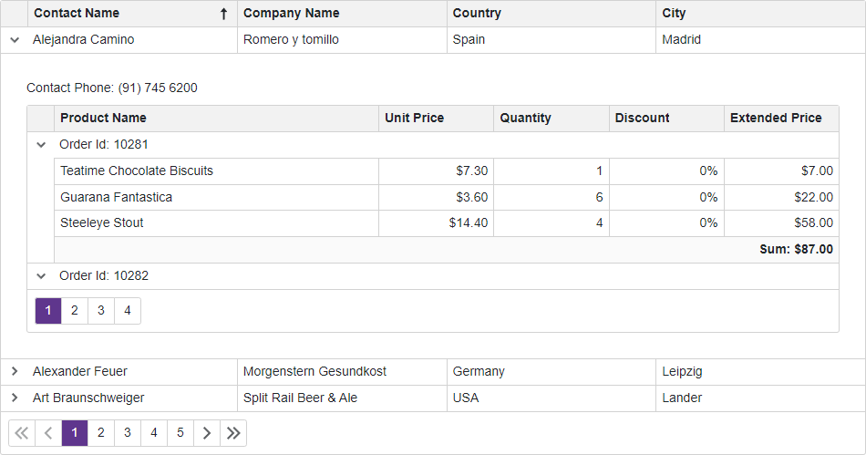

<!-- default badges list -->

<!-- default badges end -->
# Grid for Blazor - How to create a master-detail layout with a nested Grid

The [DevExpress Blazor Grid](https://docs.devexpress.com/Blazor/403143/grid) component allows you to create hierarchical layouts of any complexity and depth. This example demonstrates how to use a nested grid component to visualize a master-detail relationship between two data tables.

## Overview

Follow the steps below to implement a layout with a nested grid:

1. Add a master Grid to a page. [Bind](https://docs.devexpress.com/Blazor/403737/grid/bind-to-data) the Grid to data and populate it with [columns](https://docs.devexpress.com/Blazor/DevExpress.Blazor.DxGrid.Columns).

2. Put a detail Grid to a separate component and bind this Grid to data.

3. Add the [DetailRowTemplate](https://docs.devexpress.com/Blazor/DevExpress.Blazor.DxGrid.DetailRowTemplate) to the master Grid's markup. Add the component that displays the detail Grid to this template. Use the template's [context](https://docs.devexpress.com/Blazor/DevExpress.Blazor.GridDetailRowTemplateContext) object to filter the detail Grid's data.

4. Set the master Grid's [AutoCollapseDetailRow](https://docs.devexpress.com/Blazor/DevExpress.Blazor.DxGrid.AutoCollapseDetailRow) property to `true` to collapse the expanded detail row once a user expands another detail row.

## Files to Review

* [Index.razor](./CS/Pages/Index.razor)

## Documentation

* [Examples](https://docs.devexpress.com/Blazor/404035/grid/examples)

## More Examples

* [Grid for Blazor - How to implement cascading combo boxes](https://github.com/DevExpress-Examples/blazor-dxgrid-cascading-combo-boxes)
